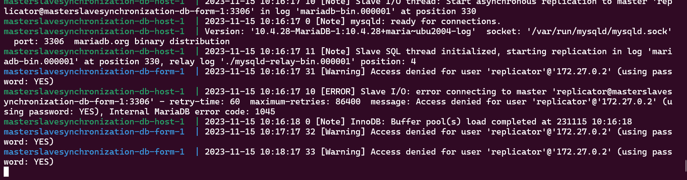

# MySQL Docker 容器主从复制设置指南

本指南将指导您如何使用 Docker 搭建两个 MariaDB 实例，并配置它们为主从复制模式。该过程涉及修改配置文件、设置权限、创建用户以及初始化数据库。

## 前提条件

- 安装 Docker 和 Docker Compose。
- 基本的 MySQL 和 Docker 知识。
- 适当的权限来访问和操作主机系统和 Docker。

## 详细步骤

### 编写 Docker Compose 文件
创建一个 docker-compose.yml 文件，定义两个服务：db-host 用于主数据库，db-form 用于从数据库。

```yml
version: '3.8'
services:
  db-host:
    image: mariadb:10.4.28
    environment:
      MYSQL_ROOT_PASSWORD: 'root_password'
      MYSQL_DATABASE: 'database'
      MYSQL_USER: 'user'
      MYSQL_PASSWORD: 'password'
    ports:
      - "3307:3306" #添加这行以映射端口 3307 防止与其他数据库端口冲突
    volumes:
      - ./path/to/your/sqlfile.sql:/docker-entrypoint-initdb.d/init.sql  # 导入数据库
  db-form:
    image: mariadb:10.4.28
    environment:
      MYSQL_ROOT_PASSWORD: 'root_password'
      MYSQL_DATABASE: 'database'
      MYSQL_USER: 'user'
      MYSQL_PASSWORD: 'password'
    ports:
      - "3308:3306" #添加这行以映射端口 3307 防止与其他数据库端口冲突
    volumes:
      - ./path/to/your/sqlfile.sql:/docker-entrypoint-initdb.d/init.sql  # 导入数据库
```
### 使用 Docker Compose 启动容器：
```bash
docker-compose up
```


### 配置主数据库
#### 登录到主数据库容器。 
```docker exec -it masterslavesynchronization-db-host-1 /bin/bash```

#### 修改数据库配置文件
```bash 
apt-get update && apt-get install -y vim && vim /etc/mysql/my.cnf
```


去掉上面配置的注释
- 设置 server-id 为唯一值（例如 1）。
- 开启二进制日志（binlog），通过添加 log_bin。
- 指定一个唯一的日志文件名，例如 log_bin = /var/log/mysql/mysql-bin.log。


#### 重启主数据库容器
```docker restart  masterslavesynchronization-db-host-1```

#### 登录数据库
``` mysql -u root -p```

#### 创建复制用户
```sql
CREATE USER 'replicator'@'%' IDENTIFIED BY 'password';
GRANT REPLICATION SLAVE ON *.* TO 'replicator'@'%';
FLUSH PRIVILEGES;
```
- > CREATE USER 'replicator'@'%' IDENTIFIED BY 'password'; 创建用户
- > 复制用户必须有 REPLICATION SLAVE 权限。
- > FLUSH PRIVILEGES  刷新权限


#### 获取主数据库状态。
```sql
SHOW MASTER STATUS;
```

记录返回的 File 和 Position 值，这些将用于从数据库的配置。

### 配置从数据库

#### 登录到从数据库容器。
```docker exec -it masterslavesynchronization-db-form-1 /bin/bash```

#### 修改数据库配置文件
```bash 
apt-get update && apt-get install -y vim && vim /etc/mysql/my.cnf
```


去掉上面配置的注释
- 设置 server-id 为唯一值（例如 2）。
- 添加 replicate-ignore-db = mysql 指定忽略主数据库的 mysql 数据库。

#### 重启从数据库容器
```docker restart  masterslavesynchronization-db-form-1```

#### 重新进入容器并且登录数据库
``` mysql -u root -p```

#### 连接到主数据库
```sql
CHANGE MASTER TO
MASTER_HOST='masterslavesynchronization-db-host-1',
MASTER_USER='replicator',
MASTER_PASSWORD='password',
MASTER_LOG_FILE='mariadb-bin.000001',
MASTER_LOG_POS=622;
START SLAVE;
```
这里就用到我们之前获取的 记录返回的 File 和 Position 值，
- MASTER_HOST 主服务器地址 ip 或者 容器名
- MASTER_USER 主服务创建的用户名
- MASTER_PASSWORD 主服务创建的用户密码
- MASTER_LOG_FILE 记录的文件名
- MASTER_LOG_POS 记录的位置

#### 验证主从复制配置

验证主从复制 获取从数据库状态。
```sql
SHOW SLAVE STATUS\G;
```

> 确保 Slave_IO_Running 和 Slave_SQL_Running 都是 Yes

####  测试主从复制    

查询主库主库数据


查询从库数据


更新主库数据


验证从库是否更新


设置成功